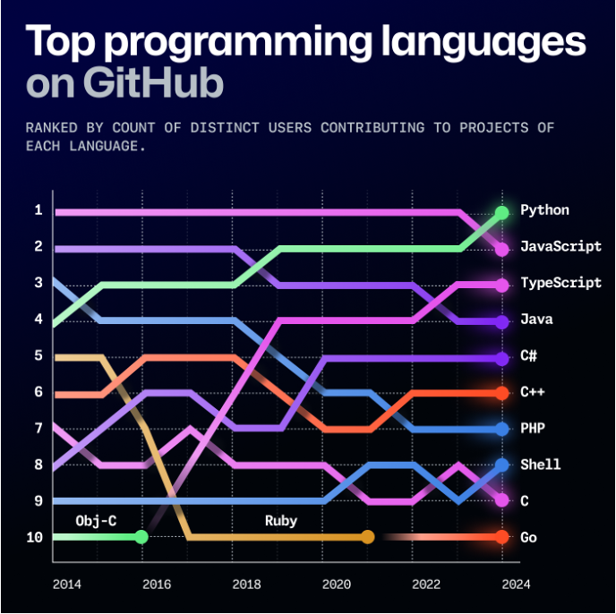
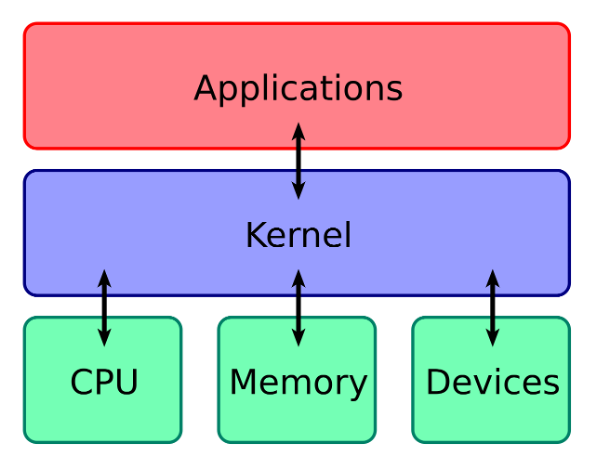
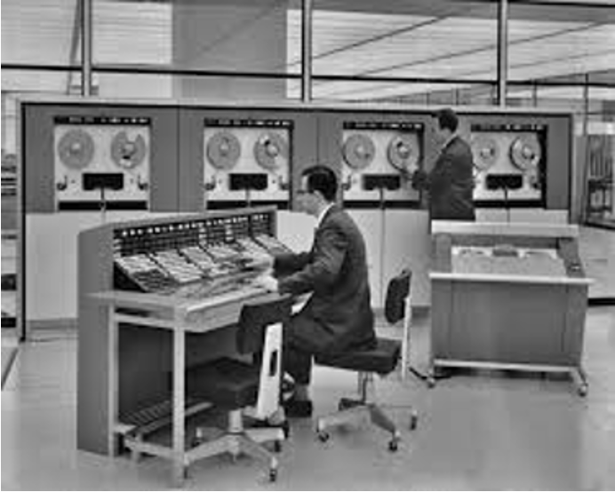

# This class {background-color="#40666e"}

## This class 

- Too much to cover in one term: survey of important topics
- Course Canvas: [https://canvas.calpoly.edu/courses/187882](https://canvas.calpoly.edu/courses/187882)
- Syllabus: [https://schmittpaul.github.io/CSC4553F26/syllabus.pdf](https://schmittpaul.github.io/CSC4553F26/syllabus.pdf)

:::{.incremental}
- Waitlists...
- What OSes do you all run?
:::

## Who am I?
:::{.incremental}
- [https://pschmitt.net](https://pschmitt.net)
- Academics
  - PhD at UCSB
  - Researcher at UC Berkeley (ICSI)
  - Some other stops… Princeton, USC, Stanford, UH
- Privacy startup co-founder & CEO, measurement startup COO
:::

## Who are you?

::: {.nonincremental}
- Name / Major / Year
- Where do you identify as your hometown?
:::

## How to succeed in this class
:::{.incremental}
- Turn things in
  - Labs are due on Fridays
  - Quizzes are due on Mondays
  - Programming assignments are due on Wednesdays
- Attend class
  - … on time. Lectures will start on time
- Ask questions
  - I'm very flexible about how much we cover this term
  - I would rather teach less and have everyone understand it
  - Our back-and-forth during class is the one of the few indicators I have of how much you are absorbing
- Talk to me if you are struggling
:::

## What are we doing here?

:::: {.columns}

::: {.column width="50%" .incremental}
- How many of you have participated in OS development?
- How many of you regularly program in languages that use operating system abstractions directly?
- And C is a decreasingly popular language!
- So why study operating systems? Why is this class even offered? [Why is it required?]{.alert}

:::

::: {.column width="5%"}
:::

::: {.column width="45%"}

:::

::::

## Why take this class

- You are required to do so in order to graduate
- [Reality]{.alert}: this is how computers really work, and as a computer scientist or engineer you should know how computers really work
- [Ubiquity]{.alert}: operating systems are everywhere and you are likely to eventually encounter them or their limitations
- [Beauty]{.alert}: operating systems are examples of mature solutions to difficult design and engineering problems. Studying them will improve your ability to design and implement abstractions

## Course progression
:::{.incremental}
- Introduction to operating system abstractions and structures
- Abstracting and multiplexing:
  - [CPU]{.alert}: interrupts, context, threads, processes, processor scheduling, thread synchronization, deadlocks
  - [Memory]{.alert}: memory layout, address translation, paging and segmentation, address spaces, translation caching, page fault handling, page eviction, swapping
  - [File systems and storage]{.alert}: disk scheduling, on-disk layout, files, buffer cache, crash and recovery
  - [Security]{.alert} (time permitting)
:::

# Background {background-color="#40666e"}

## Questions to consider
:::{.nonincremental}
- What is an operating system?
- What do they do?
- How did OSes evolve?
- How do the requirements differ for different OSes?
:::

## What is an operating system?

:::: {.columns}

::: {.column width="70%" .incremental}

- Operating System:
  - A [computer program]{.alert} that
  - [multiplexes]{.alert} hardware resources and
  - implements useful [abstractions]{.alert}.
- The OS is just another computer program. Has the highest privilege. The core of the OS consists of the [kernel]{.alert}
- [Multiplexing]{.alert} allows multiple people or programs to use the same set of hardware resources - processors, memory, disks, network connection - safely and efficiently.
- [Abstractions]{.alert} simplify the usage of hardware resources by organizing information or implementing new capabilities.

:::

::: {.column width="5%"}
:::

::: {.column width="25%"}

:::

::::

## OS history - how did we get here?

:::: {.columns}

::: {.column width="55%" .incremental}

- Started out as [libraries]{.alert} to provide common functionality across programs
  - See any issues with this approach?
- Later, evolved from [procedure call]{.alert} to [system call]{.alert}
  - What's the difference?
- Evolved from running a single program to [multiple processes concurrently]{.alert}
  - New issues to solve?
:::

::: {.column width="5%"}
:::

::: {.column width="40%"}

:::

::::

::: {.notes}
- Imagine you allowed any process to read anywhere from the disk or memory. There is no privacy.

- Memory protection, concurrency / scheduling issues
:::

## Types of operating systems

- Desktop
- Time share/Mainframe
- Mobile
- Web
- Real-time
- Embedded
- Virtual Machines

## Tl;dr
OSes continue to evolve as environments (i.e., constraints) change

## {background-color="#6E404F"}

::: {.r-fit-text}
What isn't clear?

Comments? Thoughts?
:::

