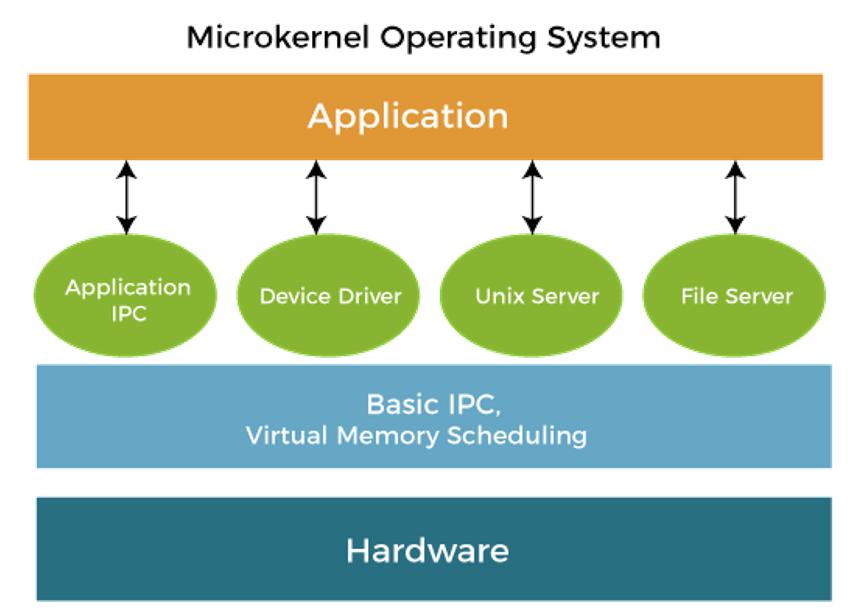
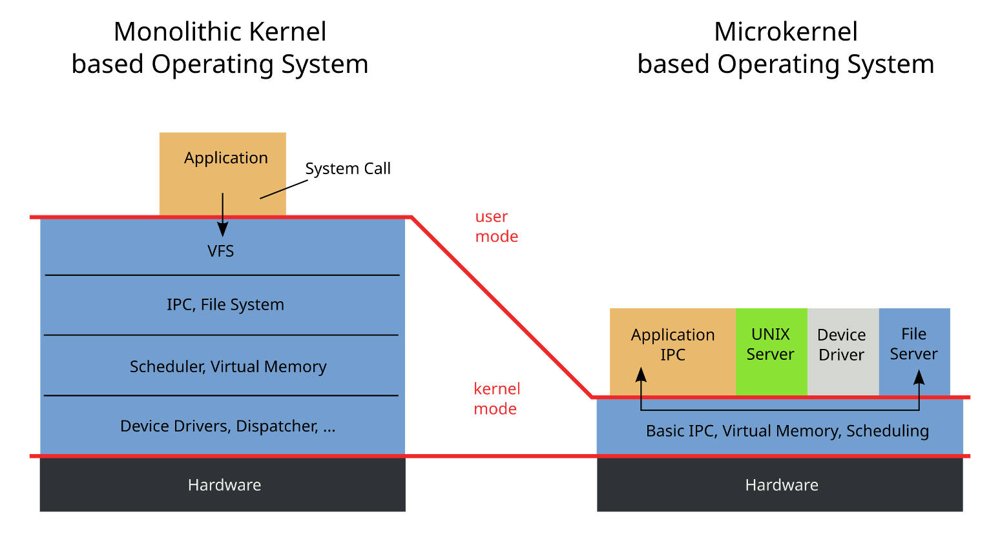

## Admin
:::{.nonincremental}
- Lab 2 due Friday, 18:00
- Quiz 2 due Monday, 18:00
:::

# Kernel basics {background-color="#40666e"}

## Questions to consider
:::{.nonincremental}
- What are the different kernel paradigms?
- Why would you choose one over the other?
:::

## Paradigms

- The OS offers a number of services. What should go in the kernel?
  - IPC
  - VFS
  - File system
  - Scheduler
  - Virtual Memory
  - Device drivers

## Monolithic kernels
:::{.incremental}
- Oldest, very common design (Linux, Windows 9x, BSDs)
- Single piece of code in memory
- Limited [information hiding]{.alert}
  - One part of the kernel can directly access data and functions of other parts
:::

## Monolithic kernels (cont'd)
:::{.incremental}
- Q: What happens when you need something new supported (new hardware device, new system call, new filesystem)?
- [Modules]{.alert} (loadable kernel modules - LKMs) allow for flexibility, customization, support
  - Pros?
    - Memory savings
    - Flexibility
    - Minimal downtime
  - Cons?
    - (minor) fragmentation: the base kernel can be loaded contiguously in memory
    - Security ([https://github.com/m0nad/Diamorphine](https://github.com/m0nad/Diamorphine) **DO NOT USE THIS, IT'S SIMPLY TO SHOW YOU**)
:::

## Layered kernels
:::{.incremental}
- Dijkstra created the THE OS in the 60s, introducing the concept
Each inner layer is more privileged; required a trap to move down layers
- Hardware-enforcement possible
- Intel [announced](https://www.intel.com/content/www/us/en/developer/articles/technical/envisioning-future-simplified-architecture.html) in May 2024 that the new architectures will only have rings 0 and 3
:::

## Microkernels

:::: {.columns}

::: {.column width="55%" .incremental}

- Popular research area long ago, didn't win (although people remain interested in the principles)
- All non-essential components removed from the kernel, for modularization, extensibility, isolation, security, and ease of management
- A collection of OS services running in user space
- Downsides?
  - **Heavy communication costs** through message passing (marshaled through the kernel)

:::

::: {.column width="5%"}
:::

::: {.column width="40%"}
{.fragment}
:::

::::

## Monolithic vs Microkernel

## Hybrid kernels
:::{.incremental}
- Combine a monolithic core with microkernel ideas
- Small kernel handles critical services (scheduling, IPC, low-level memory)
- Other services (file systems, drivers) can run in kernel *or* user space
- Examples: macOS (XNU), Windows NT
  - XNU: Mach microkernel + BSD monolithic layer
  - Windows NT: microkernel-inspired, but most services run in kernel mode for performance
- Pragmatic compromise: [microkernel isolation where it matters, monolithic speed where it doesn't]{.alert}
:::

## {background-color="#6E404F"}

::: {.r-fit-text}
What isn't clear?

Comments? Thoughts?
:::

# Dual-mode / Syscalls {background-color="#40666e"}

## Questions to consider
:::{.nonincremental}
- How do we ensure that a user process doesn't harm others?
- How do system calls work? How do they relate to wrapper libraries like `glibc`?
:::

## Interrupts and traps
:::{.incremental}
- How does the OS regain control of the CPU when a process is running?
- Two mechanisms that transfer control to the kernel:
  - [Hardware interrupts]{.alert}: asynchronous, generated by devices
    - Timer, disk I/O completion, keyboard, network
    - CPU checks for pending interrupts between instructions
  - [Software traps]{.alert}: synchronous, generated by the running program
    - System calls (intentional)
    - Exceptions: divide-by-zero, page fault, illegal instruction (unintentional)
- Both use the same basic mechanism: save state, jump to a kernel handler via an [interrupt vector table]{.alert}
:::

## Interrupts and traps (cont'd)

## Why this matters
:::{.incremental}
- Without hardware interrupts, a misbehaving process could monopolize the CPU forever
- The [timer interrupt]{.alert} is the foundation of preemptive scheduling (we'll talk about scheduling later)
  - Hardware timer fires periodically (e.g., every 1-10 ms)
  - Forces a trap into kernel mode regardless of what the process is doing
  - Kernel's scheduler decides: resume this process or switch to another?
- This is the answer to: "if the process has the CPU, who stops it?"
  - [The hardware stops it]{.alert}
:::

## Dual-mode operation
:::{.incremental}
- Dual-mode operation allows OS to protect itself and components
  - [User mode]{.alert} and [kernel]{.alert} mode
- Mode bit provided/enforced by hardware
  - Provides ability to distinguish when system is running user code or kernel code.
  - When a user is running → mode bit is "user"
  - When kernel code is executing → mode bit is "kernel"
- [System call]{.alert} changes mode to kernel, return from call resets it to user
- Some instructions are only executable in kernel mode
:::

## Hardware support for dual-mode
:::{.incremental}
- The mode bit by itself doesn't protect anything — it's just a flag
- The hardware has to enforce four things:
  1. A [mode bit]{.alert} that user code cannot set on its own
  2. [Privileged instructions]{.alert} that only work in kernel mode
  3. [Memory protection]{.alert} so a process can't touch kernel memory
  4. A [timer]{.alert} so the kernel always gets the CPU back
- Remove any one of them and the protection falls apart
:::

## The mode bit and traps
:::{.incremental}
- The mode bit lives inside the CPU, not in memory the process can write to
  - So a process can't just flip it to "kernel"
- The [only]{.alert} way into kernel mode is a trap
- A trap does two things [at the same time]{.alert}:
  - Switches the mode bit to kernel
  - Jumps to an address the [kernel]{.alert} picked in advance (the interrupt vector table)
- That second part is the whole trick
  - If you could pick the address, you'd get kernel mode *and* run your own code
:::

## Privileged instructions
:::{.incremental}
- Some instructions only work in kernel mode; try them in user mode and you get a trap instead
- Roughly, anything that would let you escape the sandbox:
  - Switching back to user mode (returning from a trap)
  - Changing where the interrupt vector table points
  - Changing the memory mapping for a process
  - Talking to devices directly
  - Turning off interrupts
- Q: why does "turn off interrupts" have to be privileged?
:::

::: {.notes}
Because turning off interrupts turns off the timer interrupt. A process could then loop forever and never be preempted — it owns the machine. Same idea for changing the vector table: point it at your own code, trigger a trap, and now your code is running in kernel mode.
:::

## Memory protection
:::{.incremental}
- The mode bit controls which *instructions* you can run
- It says nothing about which *memory* you can touch — that's a separate mechanism
- Every memory access goes through hardware that checks the page table
  - Pages are marked "kernel only" or "user OK"
  - Touching a kernel page from user mode is a trap (this is a [segfault]{.alert})
- And changing that mapping is itself a privileged instruction
  - Otherwise you'd just remap the kernel into your own address space
:::

## The timer
:::{.incremental}
- A piece of hardware that fires an interrupt every few milliseconds, no matter what the CPU is doing
- That interrupt is a trap, so it puts the kernel back in control
- Setting the timer (or turning it off) is privileged — only the kernel can do it
- Without it, the kernel only runs when a process *chooses* to ask for something
  - Protection that depends on the good behavior of the program you're protecting against isn't protection
- We'll come back to what the kernel *does* with that control when we cover scheduling
:::

## System calls
:::{.incremental}
- The OS offers a number of services. How do we (applications) interface with them?
  - We don't want to deal with the details, just the abstraction
  - The OS has ultimate control over these operations
- System calls are the "language" of communication with the OS
- Standards
  - Win32 (MS)
  - POSIX (nearly all Unix-based systems)
:::

## System calls (cont'd)
:::{.incremental}
- We call into the library wrapper (e.g., `glibc`) which places arguments into registers
- Each system call has a special number that identifies it to the kernel
- Executes a TRAP instruction (switch to kernel mode)
- A logical separation of memory space
- Kernel's system call handler is invoked, once done (but may block) may be returned to the process
:::

## System calls (cont'd)
:::{.incremental}
- Table defined in the kernel: [https://github.com/torvalds/linux/blob/master/arch/x86/entry/
syscalls/syscall_32.tbl](https://github.com/torvalds/linux/blob/master/arch/x86/entry/syscalls/syscall_32.tbl)
  - Note that system call tables can differ between architectures
- You can run using the table values themselves using the `syscall()` wrapper
  - Q: why does `syscall()` exist?
  - If you're interested… There are debates [https://lwn.net/Articles/771441/](https://lwn.net/Articles/771441/)
:::

## A driver crashes (5 min)
:::{.nonincremental}
- A USB driver has a bug: it dereferences a null pointer.
- Work through what happens under [each]{.alert} of the three designs:
  - Monolithic
  - Microkernel
- For each one:
  - What happens to the rest of the system?
  - What does the user see, and what do they have to do about it?
  - Who has to be trusted for this to go well?
- Follow-up: does it change anything if the monolithic kernel loaded the driver as a [module]{.alert} instead of compiling it in?
:::

::: {.notes}
Answer sketches:

Monolithic: the driver runs in kernel mode, so the null dereference is a fault the kernel takes on itself — kernel panic / BSOD. Everything dies, user reboots. There's no protection boundary between the driver and the rest of the kernel: dual-mode protects the kernel from *user processes*, and this code is not a user process. Trusted: every line of code in the kernel, including a device driver that may have been written by the hardware vendor.

Microkernel: the driver is just a process. It dereferences null, the MMU traps it, the driver process dies. The kernel notices its service died and can restart it. The USB stick stops working for a moment; the machine stays up. This is the isolation argument for microkernels, and the reason the idea is still around even though microkernels "lost." Trusted: only the small kernel. The cost is the message-passing overhead from the earlier slide — every USB read is IPC instead of a function call.

Follow-up (modules): no, it doesn't change anything at runtime. Loading as a module changes *when* the code enters the kernel, not *where it runs* — once loaded it's kernel-mode code with full access. Still a panic. This is the security bullet from the modules slide (and the Diamorphine link): a module is arbitrary kernel-mode code. Students often assume modules are sandboxed because they're loadable; they aren't.

Share-out: the point is that "in the kernel" vs "in user space" is the same boundary we spent the second half of class on.

If there's time / a strong group: Linux drivers in Rust and eBPF's in-kernel verifier are both attempts to get microkernel-style safety at monolithic speed by checking the code instead of hardware-isolating it.
:::

## {background-color="#6E404F"}
::: {.r-fit-text}
What isn't clear?

Comments? Thoughts?
:::
