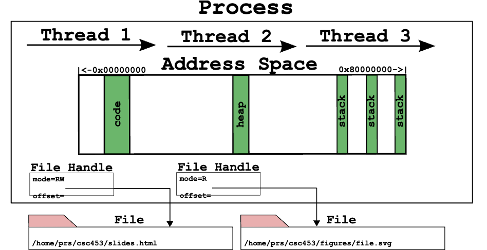
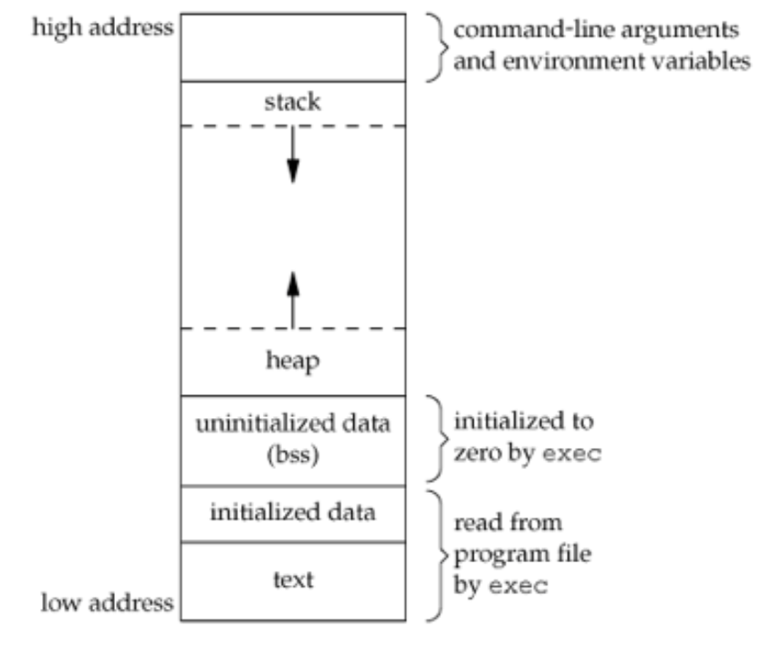
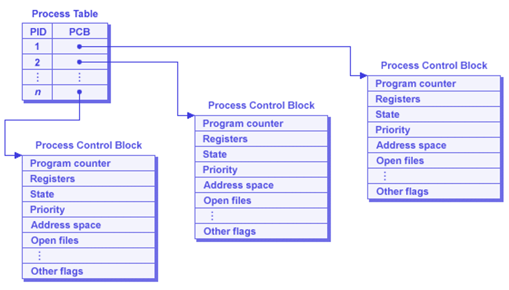
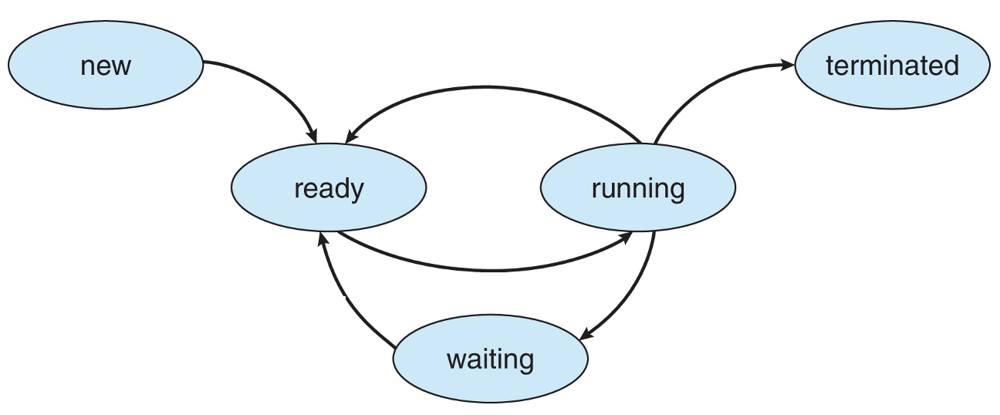
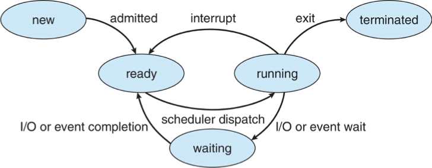

## Admin
:::{.nonincremental}
- Quiz 2 due today, 18:00
:::

# Process basics {background-color="#40666e"}

## Questions to consider
:::{.nonincremental}
- What do processes contain?
- How does the OS run multiple processes at the same time?
- How are processes laid out in memory?
- How does the OS store information about each process?
:::

## Processes
:::{.incremental}
- Most fundamental OS abstraction
  - Processes organize information about other abstractions and represent a single thing the computer is "doing"
- When you run an executable program (passive), the OS creates a [process]{.alert} == a running program (active)
- One program can be multiple processes
:::

## Process organization

:::: {.columns}

::: {.column width="45%" .incremental}
- Unlike threads, address spaces and files, processes are not tied to a hardware component. Instead, they contain other abstractions
- Processes contain:
  - one or more [threads]{.alert},
  - an [address space]{.alert}, and
  - zero or more open [file handles]{.alert} representing files
:::

::: {.column width="5%"}
:::

::: {.column width="50%"}
{.fragment}
:::

::::

## Multiprogramming
:::{.incremental}
- Processes are the core abstraction that allows for [multiprogramming]{.alert}: the illusion of concurrency
- OS timeshares CPU across multiple processes: virtualizes CPU
- OS has a CPU scheduler that picks one of the many active processes to execute on a CPU
- Policy:
  - [which]{.alert} process to run
- Mechanism:
  - how to [context switch]{.alert} between processes
:::

## Process's view of the world
:::{.incremental}
- Own memory with consistent addressing (divorced from physical addressing)
- It has exclusivity over the CPU: It doesn't have to worry about scheduling
- Conversely, it doesn't know when it will be scheduled, so real time events require special handling
- Has some identity: `pid`, `gid`, `uid`
- Has a set of services available to it via the OS
  - Data (via file system)
  - Communication (sockets, IPC)
  - More resources (e.g., memory)
:::

## Process memory layout
:::: {.columns}

::: {.column width="48%" .incremental}
- [Text]{.alert} segment: machine instructions; shareable between identical processes; read-only
- [Data]{.alert} segment: for initialized data; e.g.,
```int count = 99;```
- [BSS]{.alert} (block started by symbol) segment: uninitialized data; e.g., `int sum[10];`
- [Heap]{.alert}: dynamic memory allocation
- [Stack]{.alert}: initial arguments and environment; stack frames
:::

::: {.column width="2%"}
:::

::: {.column width="50%"}
{.fragment}
:::

::::

## OS's view of the (process) world
:::: {.columns}

::: {.column width="38%" .incremental}
- Data for each process is held in a data structure known as a [Process Control Block]{.alert}
- Partitioned memory:
  - dedicated & shared address space
  - perhaps non-contiguous
- [Process table]{.alert} holds PCBs

:::

::: {.column width="2%"}
:::

::: {.column width="60%"}
{.fragment}
:::

::::

## Where does it live?

:::{.nonincremental}
- [Think (2 min)]{.alert}: which segment holds each labeled item: [text]{.alert}, [data]{.alert}, [BSS]{.alert}, [heap]{.alert}, or [stack]{.alert}?
  ```c
  int   count = 99;              // (a) count
  char  buf[4096];               // (b) buf
  int main(int argc, char **argv) {
      int i = 0;                 // (c) i
      char *p = malloc(1024);    // (d) p    (e) what p points to
      printf("%d\n", count);     // (f) the literal "%d\n"
      return 0;                  // (g) the instructions of main() itself
  }
  ```
- [Discuss (2 min)]{.alert}: compare answers. Which ones did you disagree on?
- [Question (1 min)]{.alert}: you run this same program twice, so there are two processes. Which segments could the OS share between them, and which have to be private?
:::

::: {.notes}
Answers:

- (a) `count` — **data**: initialized, global, non-zero.
- (b) `buf` — **BSS**: global but uninitialized, so the executable only records "4096 zero bytes here" instead of storing 4096 zeros on disk. This is the whole reason BSS exists.
- (c) `i` — **stack**: local to `main`, lives in `main`'s stack frame. So do `argc` and `argv`.
- (d) `p` — **stack**: `p` is itself a local variable, an 8-byte pointer in the frame.
- (e) what `p` points to — **heap**: the 1024 bytes `malloc` returns. The classic student mistake is collapsing (d) and (e); the pointer and the pointee live in different segments, which is exactly why returning a pointer to a local is a bug but returning a `malloc`'d pointer is fine.
- (f) `"%d\n"` — **text** (or a read-only data section next to it). String literals are read-only; writing through a `char *` to one faults.
- (g) the code of `main()` — **text**.

Share-out: text is identical across the two processes and read-only, so the OS maps one physical copy into both address spaces. Everything else has to be private — each process needs its own `count`, its own stack, its own heap. This is the payoff of the "shareable between identical processes" bullet, and it previews copy-on-write when we get to `fork()`.

If a group finishes early: where do `argv`'s *strings* live, as opposed to the `argv` array? (Above the stack, in the region the kernel set up at exec time.)
:::

## {background-color="#6E404F"}
::: {.r-fit-text}
What isn't clear?

Comments? Thoughts?
:::

# Process state and scheduling {background-color="#40666e"}

## Questions to consider
:::{.nonincremental}
- What are the different process states and what causes transitions?
- What is a context switch?
- What are the two general categories of processes and how do they differ?
:::

## Process states
- As a process executes, it changes *state*
  - [New]{.alert}: The process is being created
  - [Running]{.alert}: Instructions are being executed
  - [Waiting]{.alert}: The process is waiting for some event (typically I/O or signal handling) to occur
  - [Ready]{.alert}: The process is waiting to be assigned to a processor
  - [Terminated]{.alert}: The process has finished execution

## Process state transitions




## Process state transitions (cont'd)
:::: {.columns}

::: {.column width="45%" .incremental}
- Running process can move from running to terminated (exit or killed), moved to ready (time slice up), or blocked (signaled to wait, I/O)
- Which state transitions could happen with these expensive actions?
  - Compute a new RSA key?
  - Find the largest value in a 1TB of data?
:::

::: {.column width="2%"}
:::

::: {.column width="53%"}

:::

::::

::: {.notes}
- Running to Waiting: This transition occurs when a process cannot continue executing until a specific event occurs. Here are some examples:
  - I/O Operations:
    - Example: A process needs to read data from a disk. It issues an I/O request and then moves to the Waiting state until the data is read and available.
    - Real-World Scenario: A web server process waiting for data to be read from a database.
  - Resource Availability:
    - Example: A process requires a resource (like a printer) that is currently in use by another process. It moves to the Waiting state until the resource becomes available.
    - Real-World Scenario: A document editing application waiting for access to a shared printer.
  - Inter-Process Communication (IPC):
    - Example: A process is waiting for a message from another process. It moves to the Waiting state until the message is received.
    - Real-World Scenario: A chat application waiting for a message from a server.
  - Synchronization Primitives:
    - Example: A process is waiting for a lock or semaphore to be released by another process. It moves to the Waiting state until the lock is available.
    - Real-World Scenario: A banking application waiting for a transaction lock to be released.
- Running to Ready: This transition occurs when a process is preempted by the scheduler, but it is still ready to run as soon as it gets CPU time again. Here are some examples:
  - Time Slice Expiration:
    - Example: A process has used up its allocated time slice. The scheduler preempts it and moves it to the Ready state, allowing another process to run.
    - Real-World Scenario: A video streaming application being preempted to allow a background update process to run.
  - Higher Priority Process:
    - Example: A higher priority process becomes ready to run. The scheduler preempts the current process and moves it to the Ready state.
    - Real-World Scenario: An emergency alert system preempting a running media player application.
  - Voluntary Yield:
    - Example: A process voluntarily yields the CPU, indicating it can be preempted. The scheduler moves it to the Ready state.
    - Real-World Scenario: A background data synchronization process yielding the CPU to allow a user-initiated task to run.

:::
## State transition example

:::: {.columns}

::: {.column width="55%" .nonincremental}
- [Think (2 min)]{.alert}: a running process calls `read()` on a file. Trace its state transitions from that moment until it gets its data back. Name what causes [each]{.alert} transition
- [Discuss (2 min)]{.alert}: compare traces. Did you agree on how many transitions there are, and on what triggers each one?
- [Share (1 min)]{.alert}: now the data is already in memory (the kernel cached it earlier), so no disk access is needed. Does your trace change?
:::

::: {.column width="2%"}
:::

::: {.column width="43%"}

:::

::::

::: {.notes}
1. **Running → Waiting**: the process calls `read()`, which traps into the kernel via a system call. The kernel issues the I/O request to the disk and moves the process to the Waiting state — there's no point giving it the CPU since it literally cannot make progress until the data arrives. The process is now blocked.

2. **Waiting → Ready**: the disk finishes reading and fires a hardware interrupt. The kernel's interrupt handler runs, sees that this I/O completion is what the blocked process was waiting for, and moves it to the Ready state. Note: it does *not* go directly to Running — the scheduler still has to pick it.

3. **Ready → Running**: the scheduler eventually selects this process (maybe immediately, maybe after other processes run), performs a context switch, and restores its CPU state. Execution resumes on the instruction right after the `read()` system call — from the process's perspective, `read()` just returned.

Common student mistakes to address:
- Confusing Waiting and Ready: Waiting means blocked on an external event; Ready means runnable but waiting for CPU time.
- Thinking the process goes directly from Waiting → Running: the scheduler always mediates.
- Not recognizing the hardware interrupt as the trigger for step 2 — students often say "when the disk is done" without connecting it to the interrupt mechanism.

Share-out (cached data): there are no transitions on *this* diagram at all. The kernel copies the bytes out of its cache and returns — the process stays Running the entire time, and there was never a reason to block it.

Be careful here, because "nothing happens" is the wrong takeaway. The `read()` still traps into the kernel: it is a system call, and the page cache is kernel state, so there is no way to check "is it cached?" from user space. What happened is a **mode switch** (user → kernel → user), not a **context switch**. The process is still the running process; it's just executing kernel code on its own behalf, which is why it never leaves the Running state. Worth putting both terms on the board side by side if this comes up — students routinely use them interchangeably, and the cached `read()` is the cleanest example of one happening without the other.

Two more points worth making: (1) blocking isn't a property of `read()`, it's a property of whether the data is available, so the same line of C can be a 100ns call or a 10ms block; (2) it *could* still lose the CPU here if its time slice expires (Running → Ready), but that's the scheduler preempting it, not the I/O.

If someone asks whether the trap can be avoided: sometimes, but not for `read()`. The vDSO lets a few calls like `gettimeofday()` run entirely in user space, and `io_uring` amortizes the trap away by sharing submission/completion ring buffers with the kernel — both motivated by exactly this observation, that the mode switch is pure overhead when the data was there all along.
:::

## Process scheduling
:::{.incremental}
- [OS process scheduler]{.alert} selects among available processes for next execution on CPU core
- Goal?
  - Maximize CPU use, quickly switch processes onto CPU core
- Maintains [scheduling queues]{.alert} of processes
  - [Ready queue]{.alert}: set of all processes residing in main memory, ready and waiting to execute
  - [Wait queues]{.alert}: set of processes waiting for an event (i.e., I/O)
- Processes migrate among the various queues over their lifetime
:::

## Context switching
:::{.incremental}
- When CPU switches to another process, the system must save the state of the old process and load the saved state for the new process via a [context switch]{.alert}
- Context of a process represented in the PCB
- Context-switch time is [pure overhead]{.alert}; the system does no useful work while switching
  - The more complex the OS and the PCB → the longer the context switch
- Time dependent on hardware support
  - Some hardware provides multiple sets of registers per CPU → multiple contexts loaded at once
:::

## Context switching overhead
- On the order of microseconds on modern hardware, used to be milliseconds
- If not done intelligently, you can spend more time context-switching than actual processing
- Question: Why shouldn't processes control context switching?

::: {.notes}
- They could refuse to give up CPU (processes are greedy)
- They're intentionally isolated, and don't have enough information about other processes
- It would cause too much complication (every process would have to implement its own context switch code)
:::

## Scheduling basics
:::{.incremental}
- Scheduler usually makes the transition decisions; hides the details from the process/user
- Processes often characterized as one of two types by what state they spend most of their time in
  - [I/O bound]{.alert}: work is dependent on I/O; e.g., browser, db, media streaming
  - [CPU bound]{.alert}: work is dependent on CPU; e.g., scientific apps, cryptography
  - Why does this matter?
    - Understanding which your process is allows for optimization
      - CPU-bound? Faster CPU, parallelize.
      - I/O? Faster I/O devices, use async
- Scheduler must balance CPU- & I/O-bound processes
:::

## {background-color="#6E404F"}
::: {.r-fit-text}
What isn't clear?

Comments? Thoughts?
:::
