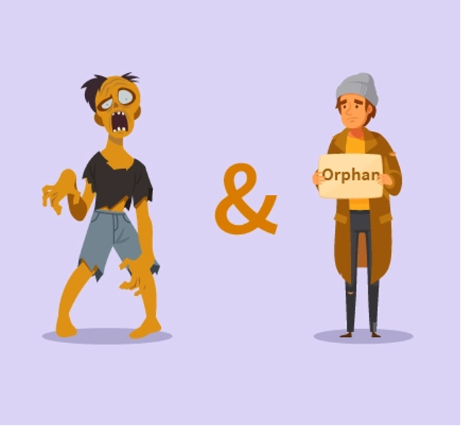

## Admin
:::{.nonincremental}
- Lab 3 due Friday, 18:00
- Quiz 3 due Monday, 18:00
- Programming assignment 1 due Wednesday, 18:00
:::

# Process management {background-color="#40666e"}

## Questions to consider
:::{.nonincremental}
- Which system calls are related to process management and lifecycles?
- How does the process hierarchy work?
- What are zombies and orphans? Why do zombies exist?
:::

## UNIX process APIs
:::{.incremental}
- `fork()` creates a new child process
  - All processes are created by forking from a parent
  - The `init` process is ancestor of all processes
    - Run `pstree` in a terminal to see
- `exec()` makes a process execute a given executable (effectively replaces the process)
- `exit()` terminates a process
- `wait()` causes a parent to block until child terminates
- Many variants exist of the above system calls with different arguments
:::

## What happens during a `fork()`?
:::{.incremental}
- A new process is created by making a copy of parent's memory image
- Both parent and child have unique address spaces (isolated from each other, allowing for independent processing)
- The new process is added to the OS process list and scheduled
- Parent and child start execution just after fork (with different return values)
- Parent and child execute and modify the memory data independently
:::


<!-- ## New `fork()` design

:::{.nonincremental}
- You're designing an OS. Instead of `fork()` + `exec()`, you provide a single `spawn(program)` call that creates a new process running `program` directly
- [Think (2 min)]{.alert}: which shell features become harder or impossible? Try to name at least two
  - Hint: what does a shell do in the gap [between]{.alert} `fork()` and `exec()`?
- [Discuss (2 min)]{.alert}: trade lists. For each feature the other person found, can you rescue it by adding an argument to `spawn()`?
- [Share (1 min)]{.alert}: Windows really works this way (`CreateProcess`). What did it have to pay for that?
:::

::: {.notes}
The key insight is that `fork()` gives the child a window of time — between `fork()` and `exec()` — where it's a copy of the parent and can reconfigure itself before becoming the new program. `spawn()` skips that window entirely.

Things that break or become much harder:

- **I/O redirection** (`ls > out.txt`): the shell currently forks, then the child closes stdout and opens the file before calling `exec()`. With `spawn()`, there's no moment to do this — you'd have to pass the desired file descriptors as arguments to `spawn()`, making the interface much more complex.
- **Pipes** (`ls | grep foo`): the shell forks twice, wires the child processes together with a pipe, then execs. Same problem — no window to set up the pipe ends before execution starts.
- **Environment manipulation** (`VAR=value command`): the child can modify its own environment between `fork()` and `exec()` without affecting the parent. With `spawn()`, the caller would need to pass the full desired environment explicitly.
- **`ulimit`, `chdir`, `nice`** before exec: same story — any per-process setup that should apply only to the child has to happen in that fork-exec window.

The broader point: `fork()` + `exec()` is a separation of "create a copy of me" from "become a different program," and that gap is where all the interesting shell plumbing lives.

Pair step: almost every feature *can* be rescued by adding a parameter — that's the point. Redirection becomes a file-descriptor table argument, environment becomes an env array, working directory becomes another argument, and so on. The question is what the interface costs by the time you've added them all.

Share-out: Windows `CreateProcess` takes 10 parameters, one of which is a struct with a dozen more fields, and there is still no general way to say "run this arbitrary snippet of my code in the child before it becomes the new program." The tradeoff runs the other way too — `fork()` is expensive to implement (the kernel has to fake copying the whole address space; copy-on-write exists precisely to make it survivable), and it interacts badly with threads, which is why POSIX also ended up with `posix_spawn()`. Neither design is free; `fork()` buys generality with implementation complexity, `spawn()` buys a cheap implementation with interface complexity.
::: -->

## Process creation
:::{.incremental}
- Different execution models
  - Parent & child may execute independently
  - Parent may wait for child
  - Child may create more children (Process hierarchies)
  - Parent may kill children
- Child often invokes `exec()` to change its memory image to a new program
- Why two steps (`fork()` then `exec()`)?
  - Allows the child to change file descriptors and other settings before `exec()`
:::

## Process destruction

{fig-align="center"}

## Process destruction (cont'd)
:::{.incremental}
- Some operating systems do not allow child to exist if its parent has terminated.  If a process terminates, then all its children must also be terminated
  - [Cascading termination]{.alert}: All children, grandchildren, etc., are terminated.
  - The termination is initiated by the operating system
- The parent process may wait for termination of a child process by using the `wait()` system call. The call returns status information and the pid of the terminated process
  ```c
  pid = wait(&status);
  ```
:::

## Zombies and orphans
:::: {.columns}

::: {.column width="63%" .incremental}
- If no parent waiting (did not invoke `wait()`), and process completes, process is a [zombie]{.alert}
  - Zombie = dead but not yet reaped (exit status hasn't been read)
  - Still has an entry in the process table
  - We need zombies: so the kernel can preserve a child's exit status until the parent calls `wait()`, even if the child exits first

:::

::: {.column width="2%"}
:::

::: {.column width="35%"}


:::

::::
:::{.incremental}
- If parent terminated without invoking `wait()`, process is an [orphan]{.alert}
  - Orphan = alive but parent is gone
  - `init` benevolently adopts orphans
:::

:::{.notes}
```
Child exits → zombie
Parent exits → zombie becomes orphan
init adopts it → init calls wait() → zombie disappears
```
:::

## {background-color="#6E404F"}
::: {.r-fit-text}
What isn't clear?

Comments? Thoughts?
:::

# Modern process isolation {background-color="#40666e"}

## Questions to consider
:::{.nonincremental}
- What are namespaces and cgroups?
- How do they differ from virtual machines?
- How do containers use them to isolate processes?
:::

## Isolation without full virtualization
:::{.incremental}
- [Virtual machines]{.alert} provide complete isolation by emulating entire hardware + OS
  - Heavier resource overhead (multiple OS instances)
  - Better isolation between workloads
- [Containers]{.alert} provide lightweight isolation using OS-level mechanisms
  - Share the same kernel
  - **Much lower overhead than VMs**
  - Linux kernel provides the building blocks: [namespaces]{.alert} and [cgroups]{.alert}
:::

## Namespaces: logical isolation (visibility)
:::{.incremental}
- Namespaces partition global system resources so they appear as separate isolated instances
- Each process belongs to a namespace and only sees resources in that namespace
- Types of namespaces:
  - [PID]{.alert}: process IDs (what processes can a process see?)
  - [Network]{.alert}: network interfaces, ports, routing tables
  - [Mount]{.alert}: filesystem mounts (what can a process access?)
  - [IPC]{.alert}: IPC objects, message queues
  - [UTS]{.alert}: hostname and domain name
  - [User]{.alert}: user and group IDs (who owns the process?)
:::

## Namespaces example
:::{.incremental}
- Two processes in separate PID namespaces think they are PID 1 (init)
- Each sees only processes within their own namespace
- From the host OS perspective, they have different global PIDs
- Enables the illusion that each container has its own isolated process tree
:::

## Seeing namespaces in action
:::{.incremental}
- View namespaces a process belongs to:
  ```bash
  ls -l /proc/self/ns/
  ```
- Use `unshare` to create a new PID namespace:
  ```bash
  unshare -pf --mount-proc bash      # creates new PID namespace, your shell is PID 1
  ps aux               # only sees processes in this namespace
  exit                 # back to host namespace
  ps aux               # will show all processes on the host
  ```
- Compare namespace inodes before and after (same inode = same namespace):
  ```bash
  ls -i /proc/self/ns/pid
  unshare -pf --mount-proc bash -c 'ls -i /proc/self/ns/pid'  # different inode
  ```
:::

## Cgroups: resource limits
:::{.incremental}
- [cgroups (control groups)]{.alert} limit, prioritize, and account for resource usage of process groups
- Key capabilities:
  - [CPU limits]{.alert}: restrict how much CPU time a group can use
  - [Memory limits]{.alert}: cap memory usage; OOM killer invoked if exceeded
  - [I/O limits]{.alert}: restrict disk I/O bandwidth
  - [Device access]{.alert}: restrict which devices a process can access
- All processes in a cgroup share the same resource limitations
:::

## Seeing cgroups in action
:::{.incremental}
- View what cgroup a process belongs to:
  ```bash
  cat /proc/self/cgroup
  ```
- Check your current limits:
  ```bash
  cat /proc/self/limits  # shows per-process limits (some enforced by cgroups)
  ```
- In practice, cgroups are invisible to users, kernel enforces limits automatically when a process exceeds allocated resources
:::

## Cgroups vs. namespaces
:::{.incremental}
- [Namespaces]{.alert}: about [visibility]{.alert}—what can a process see?
  - Logical isolation of resources
- [cgroups]{.alert}: about [limits]{.alert}—how much can a process use?
  - Resource accounting and enforcement
- Together: processes appear isolated AND are prevented from consuming excessive resources
:::

## Containers as a building block
:::{.incremental}
- cgroups and namespaces are [mechanisms]{.alert}, containers allow us to apply [policy]{.alert} through orchestration
- Containers (e.g. `Docker`) allow for [policy]{.alert}: that can be orchestrated by combining namespaces + cgroups + layered filesystems
- Results in lightweight, portable process isolation
- Single kernel, multiple isolated environments
- Much cheaper than VMs, [but]{.alert} with worse isolation guarantees
:::

## Namespace or cgroup?

:::{.nonincremental}
- [Think (2 min)]{.alert}: for each symptom, is the mechanism you need a [namespace]{.alert}, a [cgroup]{.alert}, or both?
  1. A process in one container runs `ps aux` and sees another container's processes
  2. One container's runaway loop pegs all 8 cores; everything else crawls
  3. Two containers each want to bind port 80
  4. A container can read `/etc/shadow` from the host filesystem
  5. A container allocates until the host itself starts swapping
  6. A process is PID 1 to itself but PID 4242 to the host
- [Discuss (2 min)]{.alert}: compare. Any you'd label "both?"
- [Share (1 min)]{.alert}: which of these is a [security]{.alert} boundary? If containers do all of this, why do cloud providers still run untrusted code in VMs?
:::

::: {.notes}
Answers: (1) namespace (PID) — (2) cgroup (CPU) — (3) namespace (network) — (4) namespace (mount) — (5) cgroup (memory) — (6) namespace (PID).

The pattern to draw out: every "it can *see* something it shouldn't" is a namespace, every "it *used* more than its share" is a cgroup. Visibility vs. limits, which is the previous slide restated as a diagnostic.

"Both" is defensible on (5): a memory cgroup caps it, but the container also shouldn't be able to see the host's total memory in the first place — a container reading `/proc/meminfo` gets the *host's* numbers, which is a real and famous problem (JVMs and Go runtimes sizing their heaps off the host's RAM and then getting OOM-killed). Worth mentioning if it comes up; it shows the two mechanisms aren't as cleanly separated as the slide implies.

Share-out: neither one is really a security boundary, and that's the point of the last bullet on the containers slide. Both are enforced by kernel code, and all containers share [one]{.alert} kernel — a single kernel bug reachable through a syscall gets you out of every namespace and cgroup at once. A VM's boundary is the hardware's, enforced by the CPU's virtualization support, so escaping needs a hypervisor bug rather than a kernel bug — a much smaller attack surface. This is exactly why AWS Lambda and Fargate run on Firecracker microVMs rather than plain containers: multi-tenant untrusted code gets a hardware boundary, and containers are for isolating *your own* workloads from each other.
:::

## {background-color="#6E404F"}
::: {.r-fit-text}
What isn't clear?

Comments? Thoughts?
:::

