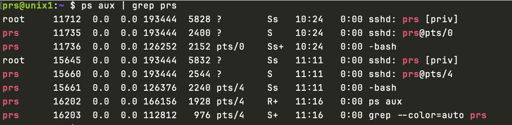
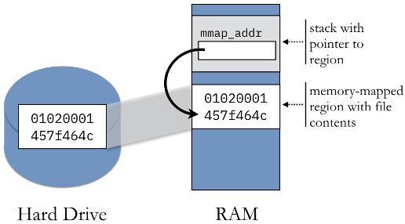

## Admin
:::{.nonincremental}
- Programming assignment 1 due Wednesday, 18:00
:::


# Process communication {background-color="#40666e"}

## Questions to consider
:::{.nonincremental}
- What are the two main strategies for IPC?
- How do they differ?
- In what situations would you choose one over the other?
:::

## Processes give us a protection boundary
:::{.incremental}
- The operating system is responsible for isolating processes from each other
- What you do in your own process is your own business *but it shouldn't be able to crash the machine or affect other processes*, or at least processes started by other users
- Thus: safe intra-process communication is [your]{.alert} problem; safe inter-process communication is an [operating system]{.alert} problem
:::

## Why do we need IPC? What are the benefits?
:::{.incremental}
- [Data Sharing]{.alert}: IPC allows processes to share data efficiently, which is crucial for applications requiring real-time data exchange
- [Modularity]{.alert}: It promotes modularity by enabling different parts of a system to communicate, making the system easier to manage and scale
- [Resource Utilization]{.alert}: IPC can help optimize resource utilization by allowing processes to coordinate their use of shared resources
- [Concurrency]{.alert} (scalability): It supports concurrent execution of processes, improving the overall performance and responsiveness of applications
:::

## What are the disadvantages of IPC?
:::{.incremental}
- [Complexity]{.alert}: Implementing IPC can add complexity to the system, requiring careful design and management to avoid issues like deadlocks and race conditions
- [Overhead]{.alert}: IPC mechanisms can introduce overhead, potentially impacting performance, especially if the communication is frequent or involves large amounts of data
- [Security]{.alert}: Ensuring secure IPC can be challenging, as it involves protecting data from unauthorized access and ensuring the integrity of the communication
- [Debugging]{.alert}: Debugging IPC-related issues can be difficult, as problems may arise from interactions between multiple processes, making them harder to isolate and resolve
:::

## What are the two main categories of IPC?
:::{.incremental}
- [Message passing]{.alert}
  - High-level abstraction for exchanging packets of information over some interconnect
- [Shared memory]{.alert}
  - Region of memory available to different processes; writable by at least one process
:::

## Message passing
:::{.incremental}
- Kernel establishes and oversees all communication
  - Process copies data to buffer, then issue system call to request transfer
  - Kernel copies data into its memory
  - Later, process issues system call to retrieve
- Two primitives: `send()` and `recv()`
- Beyond intra-computer communication, facilitates processes over a network; link implementation is unimportant
:::

## Pros and cons of message passing?
:::{.incremental}
- Pros:
  - [Easier]{.alert} to implement and manage, especially in distributed systems
  - Provides clear boundaries between processes, enhancing security and [modularity]{.alert}
- Cons:
  - Can introduce [overhead]{.alert} due to the need for message formatting and transmission
  - May be slower compared to shared memory for large volumes of data
:::

## Shared memory
:::{.incremental}
- Kernel plays a role in establishing and attaching the address space, but does not control read/write access beyond that
- How the memory is shared, and kept consistent, is left up to the processes
:::

## Pros and cons of shared memory?
:::{.incremental}
- Pros:
  - Offers [high-speed]{.alert} data exchange, as processes can directly read and write to the shared memory
  - [Efficient]{.alert} for large volumes of data
- Cons:
  - Requires careful [synchronization]{.alert} to avoid conflicts and ensure data consistency
  - Can be more [complex]{.alert} to implement and debug
:::

## {background-color="#6E404F"}
::: {.r-fit-text}
What isn't clear?

Comments? Thoughts?
:::

# IPC mechanisms {background-color="#40666e"}

## Questions to consider
:::{.nonincremental}
- How do pipes differ from FIFOs and when would you use each?
- What considerations matter when choosing between pipes, FIFOs, and memory-mapped files?
:::

## Pipes (anonymous pipes)
:::{.incremental}
- Pipes are [unidirectional]{.alert}; one end must be designated as the reading end and the other as the writing end
- Pipes are [order preserving]{.alert}; all data read from the receiving end of the pipe will match the order in which it was written into the pipe
- Pipes have a [limited capacity]{.alert} and they use [blocking I/O]{.alert}; if a pipe is full, any additional writes to the pipe will block the process until some of the data has been read
- Pipes send data as unstructured [byte streams]{.alert}. There are no pre-defined characteristics to the data exchanged, such as a predictable message length
  {.fragment}
:::

## Pipes (cont'd)
:::{.incremental}
- Pipes create a producer-consumer buffer between two processes
- Cannot be accessed outside of the creating process (child inherits the pipe since it's a fd)
- The operating system manages a queue for each pipe to accommodate different input and output rates
- Facilitates the canonical chaining together of small UNIX utilities to do more sophisticated processing
  {.fragment}
:::

## Pipe bugs
```{.c code-line-numbers="|8"}
int pipefd[2];
pipe (pipefd);

if (fork () == 0)
  exit (0);

char buffer[10];
read (pipefd[0], buffer, sizeof (buffer));
```
:::{.incremental}
- What will happen here?
  - Parent will block indefinitely. Since the child exits without writing anything, and the parent has not closed its own write end, the read end never sees `EOF` (`EOF` is only signaled when all write ends are closed).
:::

## Named pipes (also known as FIFOs)
:::{.incremental}
- Of course there is another type that don't share the same characteristics
- Named pipes don't require a parent-child relationship
  - Creates a persistent file-like name
  - Require a reader and writer
  - Can be used for unrelated processes to communicate
:::

## Named pipes (cont'd)
:::{.incremental}
- Really a data stream (ordering, buffering, reliability, authentication all implied)
- They are **not** regular files, though they look like them
  - Once data has been read from a FIFO, the data is discarded and cannot be read again
  - Cannot broadcast: only one `read()`
  - **Not** wise to use bidirectionally, why?
:::

## Shared memory with mmap
:::: {.columns}

::: {.column width="63%" .nonincremental}

- Memory-mapped files allow for multiple processes to share read-only access to a common file. Example: `libc.so` mapped into all running C programs
- Data is accessed directly from the page cache without an extra copy into a user buffer
:::

::: {.column width="2%"}
:::

::: {.column width="35%"}

:::
::::
:::{.incremental}
- Provide extremely fast IPC data exchange. i.e., when one process writes to the region, that data is immediately accessible by the other process [without having to invoke a system call]{.alert}
- Unlike pipes, memory-mapped files create [persistent]{.alert} IPC. Once the data is written to the shared region, it can be repeatedly accessed by other processes
:::

## Memory mapped files: POSIX and System V
:::{.incremental}
- These two ultimately `mmap` a file, but do some trickery beforehand and use special files
- POSIX == named, RAM-backed file descriptors
  - ```name → fd → mmap```
  - usually backed by `tmpfs` (`/dev/shm`)
- System V shared memory
  - Predates POSIX - designed before file descriptors were a universal abstraction
  - Kernel-persistent objects, you must clean up manually
    - Process exits ≠ memory freed
:::

## POSIX vs. System V
:::{.incremental}
- POSIX is great, right!?
  - POSIX (e.g., `shm_open()`) IPC may not work in your favor in macOS
  - Some questionable engineer (obviously not a CP grad) decided to provide the header files for certain things, but they are empty stubs
    - It will compile, but could be bad
- System V is "fine"
  - `shmget()`: allocate
  - `shmat()`: attach
  - `shmdt()`: detach
  - `shmctl()`: control (destroy with IPC_RMID)
:::

## Message passing vs. shared memory
:::: {.columns}

::: {.column width="48%" .nonincremental}
A camera captures frames at 30fps and a separate process runs AI inference on each frame. **Which IPC mechanism would you use? What happens if inference is slower than capture?**

:::

::: {.column width="2%"}
:::

::: {.column width="50%"}

"Gemini, make an image in the style of a video game pitting pipes versus shared memory"
:::
::::

::: {.notes}
Shared memory is the right answer here — here's why:

- Each frame is large (e.g., 1080p = ~6MB uncompressed). Copying that through the kernel on every frame via message passing adds up fast: at 30fps that's 180MB/s of unnecessary kernel copies.
- With shared memory, the camera process writes the frame into a shared buffer and signals the inference process — no copy needed.

What happens when inference is slower than capture:
- With a pipe/message queue: frames queue up. The buffer fills, writes block, and eventually the camera process stalls — you drop frames at the source.
- With shared memory + a ring buffer: the writer can overwrite old frames. You still drop frames, but the camera keeps running and the inference process always gets the most recent frame — often the right tradeoff for real-time systems (stale data is worse than no data).

Follow-up questions:

- Who synchronizes access to the shared buffer? (Needs a mutex or semaphore — the OS doesn't help here.)
- What if you need the inference results sent back? (Probably message passing for the small result, shared memory for the frame data.)
- What changes if the camera and inference run on different machines? (Shared memory is off the table; forced into message passing over a network.)
:::

## Demo

## {background-color="#6E404F"}
::: {.r-fit-text}
What isn't clear?

Comments? Thoughts?
:::