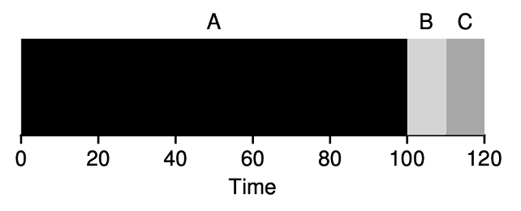

## Admin
:::{.nonincremental}
- Don't forget to sign up for assignment 1 review [https://calendar.app.google/71iRFEG6RNLqf9P29](https://calendar.app.google/71iRFEG6RNLqf9P29)
- Lab due Friday, 18:00
- Quiz due Monday, 18:00
:::

# Scheduling {background-color="#40666e"}

## Questions to consider
:::{.nonincremental}
- What are the differences / tradeoffs between preemptive and non-preemptive scheduling algorithms?
- What are the metrics we can attempt to optimize scheduling for a given scenario?
:::

## Preemptive vs. non-preemptive scheduling
:::{.incremental}
- [Non-Preemptive]{.alert}: The scheduler only makes scheduling decisions when a process voluntarily gives up the CPU (e.g., by blocking on I/O, completing, or explicitly yielding).
- [Preemptive]{.alert}: The scheduler can interrupt a running process and move it to the ready queue at any time (based on time slices, priority changes, etc.), even while it's actively executing.
- Non-preemptive is easier to implement, but
  - … doesn't support multiprogramming very well
- Preemptive can be complicated: correctness, utilization, flexibility
  - Say a process P is preempted while in the middle of inserting an element in a data structure that another process (which is chosen by the scheduler) is going to process
:::

## Scheduling metrics
:::{.incremental}
- [CPU utilization]{.alert}: keep the CPU as busy as possible
- [Throughput]{.alert}: # of processes that complete their execution per unit time
- [Turnaround time]{.alert}: amount of time to execute a particular process (from submission to completion)
- [Waiting time]{.alert}: amount of time a process spends in the ready queue
- [Response time]{.alert}: amount of time it takes from when a request was submitted until the first response is produced
:::

## Scheduling scenarios
### Which metric would you optimize for these situations?
:::: {.columns}
::: {.column width="73%" .incremental}
- You run a data center that charges based on jobs completed
  - Max throughput: maximize the number of jobs processed per unit time
- You run GeForce Now
  - Min response time: user experience is the main concern
- You run Github Actions or Travis CI
  - Min turnaround time: developers need feedback quickly
- You run a supercomputing center
  - Maximize CPU usage: this stuff is expensive, use it efficiently
:::

::: {.column width="2%"}
:::

::: {.column width="25%" .nonincremental}
- CPU utilization
- Throughput
- Turnaround time
- Waiting time
- Response time
:::
::::

## Example: Scheduling a 911 system

You're designing a scheduler for a 911 emergency dispatch system. **Which metric matters most? Are there any metrics from the list that would be actively harmful to optimize for?**

::: {.notes}
Response time is the critical metric — a dispatcher needs to see and act on an incoming call immediately. Any delay between a call arriving and the dispatcher's screen updating is unacceptable.

What's actively harmful to optimize for:

- **Throughput**: maximizing calls handled per unit time could cause the scheduler to deprioritize long-running dispatch sessions (active incidents) in favor of shorter ones — exactly backwards.
- **CPU utilization**: keeping the CPU busy is irrelevant and potentially dangerous. If a high-priority dispatch process needs to run, the CPU should be idle rather than burning cycles on something else.
- **Turnaround time**: this measures total time from start to finish of a process, which doesn't map well onto an always-on system handling continuous events.

No single metric is universally correct — the right metric depends entirely on what the system is for. Note: real safety-critical systems often use priority scheduling with hard real-time guarantees, not the algorithms we're studying (which are designed for general-purpose throughput/fairness).
:::

## What does the OS scheduler know about a process?
:::{.incremental}
- Process characteristics that we'd like to know in order to achieve our goals
  - Processing Time (Burst Time)
  - I/O Requirements
  - Priority
  - Age
  - Dependencies
- The scheduler knows very little of the above
- In many cases we are hoping to predict the future. Easy, right?
:::

## {background-color="#6E404F"}
::: {.r-fit-text}
What isn't clear?

Comments? Thoughts?
:::

# Batch scheduling algorithms {background-color="#40666e"}

## Questions to consider
:::{.nonincremental}
- How do FCFS, SJF, and SRTF compare in terms of tradeoffs between waiting time and response time?
- Why does SJF require predicting future CPU bursts, and how can we estimate them?
- What is starvation in the context of scheduling, and how can we prevent it?
:::

## Batch scheduling: FCFS
:::: {.columns}
::: {.column width="53%" .incremental}
- First-Come, First-Served (FCFS)
- **Non-preemptive**
- Pros:
  - Easy to understand, easy to implement
- Cons?
  - Waiting time & turnaround time have high variance
  - Example: 1 long CPU-bound process and many I/O bound processes
    - Convoy effect
:::

::: {.column width="2%"}
:::

::: {.column width="45%"}

{.fragment}

:::
::::

## FCFS example
:::: {.columns}
::: {.column width="73%" .incremental}
- Calculate the average waiting time:
- Order: P1, P2, P3

- Waiting time P1 = 0; P2 = 24; P3 = 27
- Average waiting time: $(0 + 24 + 27)/3 = 17$

- Order P2, P3, P1

- Waiting time P1 = 6; P2 = 0; P3 = 3
- Average waiting time: $(6 + 0 + 3)/3 = 3$
:::

::: {.column width="2%"}
:::

::: {.column width="25%"}
    Process	Burst Time
      P1	     24
      P2 	      3
      P3	      3
:::
::::

## Okay, FCFS can be bad
### Can we think of a better algorithm to deal with the reality that jobs run for different amounts of time?

## Batch scheduling: shortest job first (SJF)
:::: {.columns}
::: {.column width="63%" .incremental}
- Ordered by length of the process's next CPU burst
- **Non-preemptive**
- Pros?
  - Optimal average waiting time among non-preemptive algorithms
- Cons?
  - Requires knowing the future (potentially okay in some situations; examples?)
    - Scientific jobs, batch jobs
- Question: how do we know the length of the upcoming CPU burst?
  - Ask the process? Estimate? How?
:::

::: {.column width="2%"}
:::

::: {.column width="35%"}

:::
::::

## SJF: how can we predict the future?
:::{.incremental}
- We can't trust a process to tell the truth
- We can only estimate, how?
  - The past (with the hope that the process will act like it has before)
- Exponential weighted moving average:
  $$
  EWMA_t = \alpha \times x_t + (1 - \alpha) \times EWMA_{t-1}
  $$
- $\alpha = 0$? New measurement does not get taken into account
- $\alpha = 1$? History does not get taken into account
- $\alpha$ is often set to .5
:::

## EWMA example
$$
EWMA_t = \alpha \times x_t + (1 - \alpha) \times EWMA_{t-1}
$$

:::{.incremental}
- Suppose $\alpha = 0.5$ and a process has had burst times: 10, 6, 4, 6, ...
- $EWMA_0 = 10$
- $EWMA_1 = 0.5 \times 6 + 0.5 \times 10 = 3 + 5 = 8$
- $EWMA_2 = 0.5 \times 4 + 0.5 \times 8 = 2 + 4 = 6$
- $EWMA_3 = 0.5 \times 6 + 0.5 \times 6 = 3 + 3 = 6$
- Recent values pull the estimate toward them, but history still matters
:::

## SJF example
:::: {.columns}
::: {.column width="73%" .incremental}
- Gantt:

- Average waiting time: $(3 + 16 + 9 + 0)/4 = 7$
- Versus FCFS: $(0 + 6 + 14 + 21)/4 = 10.25$
:::

::: {.column width="2%"}
:::

::: {.column width="25%"}
		Process	Burst Time
		  P1	      6
		  P2 	      8
		  P3	      7
          P4	      3
:::
::::

## Do you see any problems with SJF?
:::{.incremental}
- What do we do if a short process arrives after SJF has started a long running process?

- What should we do?
  - Preempt
:::

## Shortest remaining time first (SRTF)
:::: {.columns}
::: {.column width="63%" .incremental}
- **Preemptive** version of SJF
- Whenever a new process arrives in the ready queue, the decision on which process to schedule next is redone using the SJF algorithm
- [Question]{.alert}: is SRTF more optimal than SJF for any metrics?
  - Yes, average waiting time is minimized
:::

::: {.column width="2%"}
:::

::: {.column width="35%"}

:::
::::

## SRTF example
		Process      Arrival Time   Burst Time
		 P1	              0	            8
		 P2               1	            4
		 P3	              2	            9
		 P4	              3             5
:::{.incremental}
- Average waiting time = $[(0+9)+(0)+(15)+(2)]/4 = 26/4 = 6.5$

:::

## Do you see any problems with SRTF?
:::{.incremental}
- Computers aren't static. What if short jobs continuously arrive?
  - Large jobs can [starve]{.alert}
  - *Urban legend about IBM 7074 at MIT: when shut down in 1973, low-priority processes were found which had been submitted in 1967 and had not yet been run...*
:::

## Priority scheduling
:::{.incremental}
- "Shortest" algos are examples of priority scheduling
- I.e., scheduling is based on some metric of priority
- Downsides
  - If not implemented carefully, indefinite blocking / starvation
  - How do we prevent starvation?
    - [Aging]{.alert}: gradually increase the priority of processes that wait in the system for a long time
:::

## {background-color="#6E404F"}
::: {.r-fit-text}
What isn't clear?

Comments? Thoughts?
:::